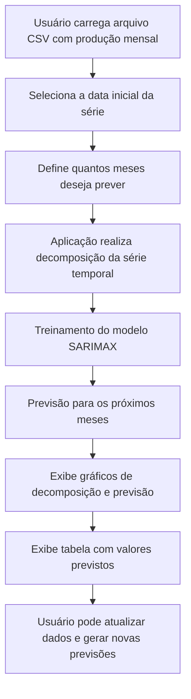
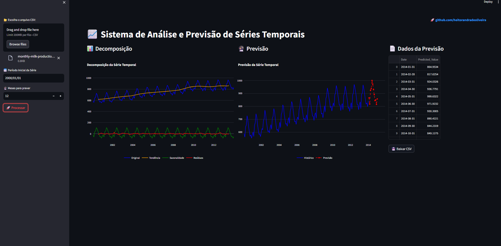

# Milk Production Forecast

Este projeto oferece uma aplicação interativa para análise e previsão da produção mensal de leite de uma fazenda.

## Objetivos da solução:

- **Analisar** a produção mensal de leite de forma visual e intuitiva.
- **Prever** a produção para os próximos meses ou anos, com horizonte flexível.
- **Atualizar** a base de dados com novas observações, mantendo as previsões sempre atuais.
- **Auxiliar** na tomada de decisão e planejamento de ações e investimentos.

**Diferenciais:**

- Entrada de dados **sem necessidade de datas** (datas são geradas automaticamente com base no início informado).
- **Flexibilidade** para escolher quantos meses prever.
- Visualização interativa com decomposição da série e gráfico de previsão.

## Estrutura do Projeto

```
├── app/
│   ├── app.py # Código da aplicação Streamlit
│   ├── monthly-milk-production-pounds-p.csv # base de dados para input no app
├── assets/
├── LICENSE # Licença MIT
├── README.md # Documentação do projeto
└── requirements.txt # Dependências do projeto

```

---

## Exemplo de Uso

1. **Acesse a aplicação** via Streamlit:

   [▶ Abrir Aplicação](https://milk-appuction-forecast-hao.streamlit.app)

2. **Carregue o arquivo CSV** contendo os valores mensais de produção de leite (uma coluna, sem cabeçalho e sem datas).
   Exemplo de arquivo:

   ```
   2500
   2650
   2700
   2600
   2750
   2850
   ```

3. **Defina a data inicial** no seletor de data.

   - Exemplo: se o primeiro valor é de **janeiro de 2020** , escolha **01/01/2020** .

4. **Escolha o período de previsão** (quantos meses quer prever).

   - Pode variar de **1 a 48 meses** .

5. **Clique em "Processar"** para gerar:

   - Decomposição da série (tendência, sazonalidade e resíduo)
   - Gráfico com histórico e previsão
   - Tabela com valores previstos

6. **Exportar dados** das previsões em formato **CSV**.
7. **Atualize os dados** sempre que necessário, carregando um CSV atualizado para recalcular as previsões.

## Como Executar Localmente

1. **Clone o repositório**
   ```bash
   git clone https://github.com/seu-usuario/nome-repositorio.git
   cd nome-repositorio
   ```

---

## Configuração do Ambiente Conda para o Projeto

Este guia descreve como configurar corretamente o ambiente Conda para executar o projeto.

### Passo a Passo

Criar o ambiente Conda com Python 3.10

```
conda create -n apps_streamlit python=3.10 pip
conda activate apps_streamlit
```

#### Instalar as dependências

```
pip install -r requirements.txt
```

## Crie um ambiente virtual e instale as dependências sem Conda

```
python -m venv venv
source venv/bin/activate   # Linux/Mac
venv\Scripts\activate      # Windowspip install -r requirements.txt
```

---

## Execute o Streamlit

```
streamlit run ./app/app.py
```

## Acesse no navegador

```
http://localhost:8501
```

---

## Fluxo do App



---

### Captura de Tela da Aplicação

Abaixo está um exemplo da interface da aplicação em execução no Streamlit.
O usuário pode:

- Carregar um arquivo CSV contendo a produção mensal de leite.
- Selecionar a data inicial da série.
- Definir quantos meses deseja prever.
- Visualizar a decomposição da série temporal (tendência, sazonalidade e resíduo).
- Consultar o gráfico da previsão e os valores previstos em formato de tabela.
- Exportar resultados das previsões em formato csv.



---

## Licença

Este projeto está sob a licença MIT - veja o arquivo [LICENSE](./LICENSE) para detalhes.

---

## Contato

LinkedIn: [linkedin.com/in/heitorandradeoliveira](https://linkedin.com/in/heitorandradeoliveira)

---
